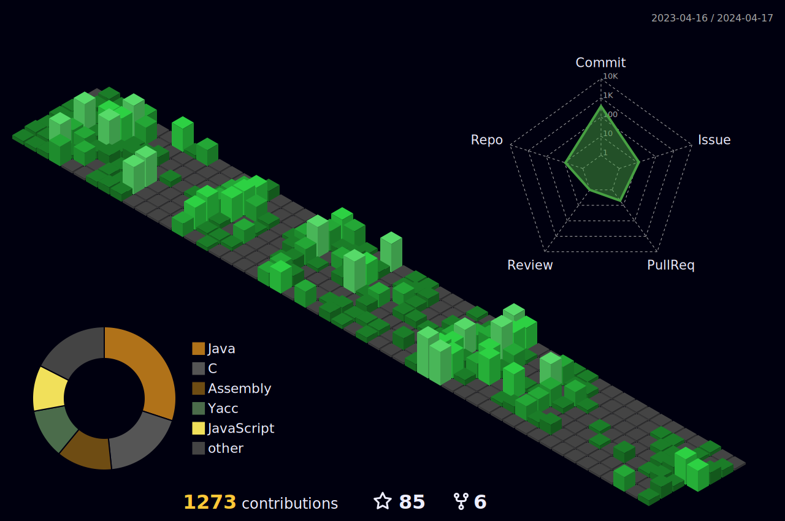

<h3 align="center">
  <a href="https://git.io/typing-svg">
    <!--      -->
    
  </a>

<h2 align="left">Hi there 👋 , I'm Roger </h1>
<p align="left">From Taiwan.</p>

我是Roger，一個正在轉職的畢業生。我喜歡專研程式問題，閒暇時研究一些有趣的知識。

<h2 align="left">Languages and Tools</h2>
<p align="left">
  <a href="https://www.cprogramming.com/" target="_blank" rel="noreferrer">
  </a>
  <a href="https://www.java.com" target="_blank" rel="noreferrer">
    
  </a>
  <a href="https://www.python.org" target="_blank" rel="noreferrer">
    
  </a>
  <a href="https://www.w3.org/html/" target="_blank" rel="noreferrer">
    
  </a>
  <a href="https://www.w3schools.com/css/" target="_blank" rel="noreferrer">
    
  </a>
  <a href="https://www.w3schools.com/css/" target="_blank" rel="noreferrer">
    
  </a>
  <a href="https://sass-lang.com" target="_blank" rel="noreferrer">
    
  </a>
  <a href="https://nodejs.org/en/" target="_blank" rel="noreferrer">
    
  </a>
  <a href="https://www.npmjs.com" target="_blank" rel="noreferrer">
    
  </a>
  <a href="https://git-scm.com/" target="_blank" rel="noreferrer">
    
  </a>
  <a href="https://www.mongodb.com/" target="_blank" rel="noreferrer">
    
  </a>
  <a href="https://www.mysql.com/" target="_blank" rel="noreferrer">
    
  </a>
    <a href="https://www.postman.com" target="_blank" rel="noreferrer">
    
  </a>
</p>

<!-- Recently Learning -->
<h3 align="left">Recently Learning</h3>
</a>
  <a href="https://www.java.com" target="_blank" rel="noreferrer">
    
  </a>
  <a href="https://www.python.org" target="_blank" rel="noreferrer">
    
  </a>
  <a href="https://www.w3.org/html/" target="_blank" rel="noreferrer">
    
  </a>
  <a href="https://www.w3schools.com/css/" target="_blank" rel="noreferrer">
    
  </a>
  <a href="https://www.w3schools.com/css/" target="_blank" rel="noreferrer">
    
  </a>
  <a href="https://sass-lang.com" target="_blank" rel="noreferrer">
    
  </a>
  <a href="https://nodejs.org/en/" target="_blank" rel="noreferrer">
    
  </a>
  <a href="https://www.npmjs.com" target="_blank" rel="noreferrer">
    
  </a>
  <a href="https://git-scm.com/" target="_blank" rel="noreferrer">
    
  </a>
  <a href="https://www.mongodb.com/" target="_blank" rel="noreferrer">
    
  </a>
  <a href="https://www.mysql.com/" target="_blank" rel="noreferrer">
    
  </a>
    <a href="https://www.postman.com" target="_blank" rel="noreferrer">
    
  </a>
  <a href="https://spring.io" target="_blank" rel="noreferrer">
    
  </a>
  <a href="https://www.postgresql.org" target="_blank" rel="noreferrer">
    
  </a>
   <a href="https://www.docker.com" target="_blank" rel="noreferrer">
    
  </a>
   <a href="https://www.nginx.com" target="_blank" rel="noreferrer">
    
  </a>
   <a href="https://zh.wikipedia.org/zh-tw/Linux" target="_blank" rel="noreferrer">
    
  </a> 

  <h2 align="left">GitHub Stats</h2>


  <p></p>

  <p></p>

<p>
  &nbsp;
</p>

<h2 align="left">Coding Stats</h2>

<a href="https://wakatime.com/@ba8829a0-ea5f-41ad-93f3-5c03e3a0e908"></a>

<!--START_SECTION:waka-->


📅 **I'm Most Productive on Tuesday** 

```text
Monday                   284 commits         █████░░░░░░░░░░░░░░░░░░░░   18.82 % 
Tuesday                  318 commits         █████░░░░░░░░░░░░░░░░░░░░   21.07 % 
Wednesday                166 commits         ███░░░░░░░░░░░░░░░░░░░░░░   11.00 % 
Thursday                 251 commits         ████░░░░░░░░░░░░░░░░░░░░░   16.63 % 
Friday                   204 commits         ███░░░░░░░░░░░░░░░░░░░░░░   13.52 % 
Saturday                 174 commits         ███░░░░░░░░░░░░░░░░░░░░░░   11.53 % 
Sunday                   112 commits         ██░░░░░░░░░░░░░░░░░░░░░░░   07.42 % 
```


📊 **This Week I Spent My Time On** 

```text
🕑︎ Time Zone: Asia/Taipei

💬 Programming Languages: 
Java                     5 hrs 30 mins       ██████░░░░░░░░░░░░░░░░░░░   23.73 % 
Markdown                 5 hrs 11 mins       ██████░░░░░░░░░░░░░░░░░░░   22.37 % 
Python                   2 hrs 52 mins       ███░░░░░░░░░░░░░░░░░░░░░░   12.38 % 
Bash                     2 hrs 35 mins       ███░░░░░░░░░░░░░░░░░░░░░░   11.14 % 
HTML                     1 hr 40 mins        ██░░░░░░░░░░░░░░░░░░░░░░░   07.23 % 

🔥 Editors: 
VS Code                  13 hrs 58 mins      ███████████████░░░░░░░░░░   60.15 % 
Intellijidea             9 hrs 15 mins       ██████████░░░░░░░░░░░░░░░   39.85 % 

💻 Operating System: 
Linux                    9 hrs 33 mins       ██████████░░░░░░░░░░░░░░░   41.13 % 
Windows                  9 hrs 24 mins       ██████████░░░░░░░░░░░░░░░   40.45 % 
Mac                      4 hrs 16 mins       █████░░░░░░░░░░░░░░░░░░░░   18.43 %
```
<!--END_SECTION:waka-->

<h2 align="left">Metrics</h2>




## 專案和興趣愛好

- 🚀 專案一：webapp
- 💻 專案二：springboot mall
- 📚 學習成果：剛剛踏入工程師的小小白
- ⚽ 興趣：運動、音樂

## 聯絡我

您可以通過以下方式與我聯絡：

- [個人網站](https://example.com)
- [Twitter](https://twitter.com/example)
- [LinkedIn](https://www.linkedin.com/feed/)


<!---
Roger3985/Roger3985 is a ✨ special ✨ repository because its `README.md` (this file) appears on your GitHub profile.
You can click the Preview link to take a look at your changes.
--->
